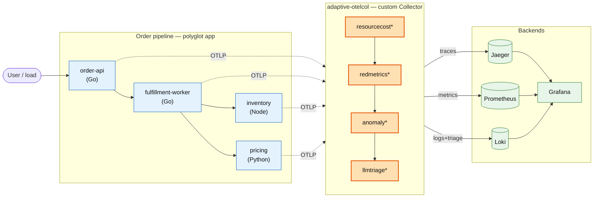
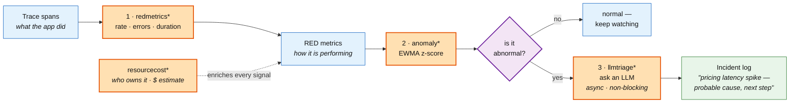

# adaptive_telemetry_pipeline

> A custom **OpenTelemetry Collector distribution** in Go that turns a raw firehose of traces, metrics, and logs into a **governed, cost-attributed, anomaly-aware** stream — and then uses an **LLM to auto-triage** the anomalies into plain-English incident summaries. It watches itself, notices when something is wrong, and explains it.


---

## What is this?

Big systems emit an overwhelming amount of telemetry. Most of it is boring — until, suddenly, it isn't. The hard problems are: **who owns this data and what does it cost to keep?**, **which numbers just went abnormal?**, and **what does an on-call human actually do about it?**

**`adaptive_telemetry_pipeline` is a purpose-built OpenTelemetry Collector that answers all three, inline, as the data flows through it.** It is built with the official **OpenTelemetry Collector Builder (`ocb`)** and ships **four original Go components** written from scratch:

1. 🏷️ **`resourcecost`** attaches an owning team and a cost estimate to every signal.
2. 📊 **`redmetrics`** turns trace spans into Rate/Errors/Duration metrics.
3. 📈 **`anomaly`** watches those metrics with a streaming detector and flags outliers.
4. 🤖 **`llmtriage`** asks an LLM to explain the outliers — asynchronously, so it never slows the pipeline down.

A small **polyglot** app (Go, Node, Python) feeds it realistic telemetry, and the whole thing runs locally on Docker Compose or on Kubernetes via the **OpenTelemetry Operator**.



<sub>🟧 Orange boxes are the custom Go components built for this project. Rendered diagrams live in [`docs/diagrams/rendered/`](docs/diagrams/rendered).</sub>

---

## The adaptive loop

The four components aren't a grab-bag — they chain into one closed loop. A latency spike becomes a metric, the metric trips a detector, and the detector's output becomes an AI-written incident note:



The theme is deliberately **AI *for* telemetry** (AIOps): deterministic maths does the detecting; the LLM does the summarizing. Knowing which job belongs to which is the whole point.

---

## Why it's built this way

| Concern | Approach |
| --- | --- |
| Run our own components | A custom distro built with `ocb`; ~70 MB distroless image vs. the multi-hundred-MB contrib image |
| Cross signal boundaries | **Connectors**, not processors — `redmetrics` (traces→metrics) and `llmtriage` (metrics→logs) |
| Data-race safety | Honest `MutatesData` flags + mutex/lock-striped state, proven with `go test -race` |
| Don't stall on the LLM | The consume path only enqueues; a worker pool does the slow work and sheds load when full |
| Cardinality & cost | A `max_series` cap on RED metrics; normalize `http.route`; a per-resource cost proxy |
| Reproducibility | Runs fully **offline with zero API keys**; the LLM backend defaults to a deterministic engine |

See [`docs/adr/`](docs/adr) for the decision records behind each of these.

---

## The custom components

All four live in [`components/`](components) as one Go module, packaged into the `adaptive-otelcol` binary via [`collector/builder-config.yaml`](collector/builder-config.yaml).

### 🏷️ `resourcecost` — processor (traces · metrics · logs)
Enriches **all three signals** with `telemetry.owner.team` (from a `service.name → team` map) and `telemetry.cost.estimate` (a volume-based USD proxy). Declares `MutatesData: true` because it writes attributes in place — generic FinOps/governance for any workload.

### 📊 `redmetrics` — connector (traces → metrics)
Emits cumulative RED metrics — `red.calls`, `red.errors`, `red.duration.ms` (histogram) — keyed by configurable dimensions, plus a per-interval `red.latency.avg.ms` **gauge** purpose-shaped for streaming detection. Caps cardinality with `max_series`.

### 📈 `anomaly` — processor (metrics)
Maintains an O(1) exponentially-weighted mean/variance **per series** and attaches `anomaly.score` (z-score) and `anomaly.is_anomaly`. Concurrency-safe via lock-striped shards; a background sweeper evicts stale series to keep memory flat. Hot path: **~9 ns/op, 0 allocations**.

### 🤖 `llmtriage` — connector (metrics → logs)
Consumes anomaly-flagged metrics and asynchronously asks an LLM for a "probable cause + affected service + next step" summary, emitted as a new **trace-correlated log record**. The consume path never blocks: it enqueues onto a bounded channel and sheds load when full. Deterministic offline engine by default; optional Anthropic (Claude) backend behind an interface. Instruments itself (queue depth, drops, LLM latency, tokens).

---

## Quickstart

**Prerequisites:** Docker + Docker Compose. (For local builds/tests: Go 1.25+, Node 22, Python 3.12.) **No API keys required** — the stack runs fully offline.

```bash
make up      # build the custom collector + services, start the stack + backends
make demo    # drive traffic, induce a latency anomaly, and surface the LLM triage log
```

Then open:

| UI | URL |
| --- | --- |
| Grafana (anonymous admin) | http://localhost:3000 |
| Jaeger (distributed traces) | http://localhost:16686 |
| Prometheus | http://localhost:9090 |
| order-api | http://localhost:8080 |

`make demo` warms the detector with baseline traffic, then injects a pricing latency spike via **W3C baggage** (`/orders?chaos=pricing&mode=slow&ms=900`). Within a few seconds the `anomaly` processor flags the `pricing` latency series and `llmtriage` emits an incident log — visible in Grafana (Loki: `{service_name="adaptive-otelcol"}`) or in the collector logs.

```bash
make down    # stop the stack and clean up
```

> **Resources:** the stack is tuned for a laptop with per-service memory limits (~2 GiB total). Grafana runs with anonymous admin for a friction-free demo — keep port 3000 bound to localhost.

### What the demo produces

Injecting the pricing latency spike flags the affected series and emits an AI-written incident log — verbatim from the offline engine, no API key involved:

```text
red.latency.avg.ms anomaly on pricing — 1 correlated signal(s) breached the anomaly
threshold; red.latency.avg.ms on pricing is the strongest (z=4.4, value=188.47).
  triage.severity            = warning
  triage.affected_service    = pricing
  triage.suggested_next_step = Inspect recent changes to "pricing" and its downstream dependencies.
  triage.engine              = deterministic
```

Meanwhile the collector's own metrics show `anomaly_flagged` climbing while `anomaly_series_tracked` stays bounded (the sweeper at work), and `llmtriage_summaries_emitted` counting the incidents — the AI component instrumenting itself.

---

## Testing

Every claim above is backed by an executable test (`-race -cover`):

| Layer | What proves it | Where |
| --- | --- | --- |
| Detector maths | z-scores match a validated Python oracle within 1e-3, incl. the EWMA "catch-up" | `components/internal/anomaly` |
| Component behaviour | table-driven tests per signal; bucket placement; cardinality cap; `MutatesData` | `components/**/**_test.go` |
| Concurrency | `-race` with concurrent `Consume*` + a live flush/sweeper | `redmetrics`, `anomaly` |
| Async boundary | `ConsumeMetrics` returns <50 ms even with a 300 ms LLM; queue sheds under flood | `llmtriage` |
| Untrusted LLM output | JSON extracted from prose, invalid severity normalized, junk rejected | `internal/llm` |
| Whole distro | `ocb build` + `validate` on the full pipeline config | CI `collector` job |

```bash
make test    # go test -race -cover ./... across the components module
make bench   # benchmarks for the hot paths
```

---

## Kubernetes

The same distro runs on Kubernetes via the **OpenTelemetry Operator** — a gateway (Deployment) + a node agent (DaemonSet), with SDK auto-instrumentation injected into app pods by annotation and `k8sattributes` enriching telemetry with pod metadata.

```bash
make k8s-validate   # kubeconform the manifests (no cluster needed)
make kind-up        # opt-in: spin a kind cluster + operator and smoke-test the loop
```

See [`deploy/k8s/README.md`](deploy/k8s/README.md) for the topology and two sharp edges worth knowing: the **Go eBPF auto-instrumentation trade-off**, and the **`Instrumentation`-before-pod ordering gotcha**.

---

## Repository layout

```
components/        # the 4 custom Collector components (one Go module) + internal/ logic
collector/         # ocb manifest · pipeline config · distroless Dockerfile
services/          # order-api, fulfillment-worker (Go) · inventory (Node) · pricing (Python) · shared SDK
deploy/compose/    # docker-compose stack + Prometheus/Loki/Grafana provisioning
deploy/k8s/        # OTel Operator: gateway + agent + Instrumentation + RBAC, kustomize overlays
docs/              # architecture · ADRs · diagrams (mermaid + rendered) · AI-workflow log
load/              # demo + load generators
```

---

## Honest limitations

- The EWMA detector assumes a roughly unimodal, non-seasonal series; strong seasonality or multi-modal data needs a companion detector (see [ADR-0005](docs/adr/0005-ewma-detector-and-its-limits.md)).
- The Collector `connector` API is still beta (`v0.x`) — a custom connector rides changeable APIs.
- The Kubernetes path is validated manifests + an opt-in `kind` smoke test, not a production HA deployment.
- The default LLM backend is deterministic (by design, for reproducibility); the Anthropic backend is real but off unless you supply a key.

## Roadmap

- Pair the fast EWMA with a slower detector / change-point detection.
- Package the components with `metadata.yaml` + `mdatagen` and land an upstream contribution to `opentelemetry-collector-contrib`.
- Renovate-driven automated manifest version bumps.

---

## Where to look

| Area | What to look at |
| --- | --- |
| **Go + Collector internals** | the four `components/`, `pdata` traversal, `MutatesData`, two connectors |
| **Pipeline design** | the adaptive loop, five pipelines, temporality & cardinality notes |
| **Kubernetes** | `deploy/k8s/` — Operator, gateway + agent, auto-instrumentation, RBAC |
| **LLM in the pipeline** | `llmtriage`'s async design and [ADR-0004](docs/adr/0004-async-llm-triage-boundary.md) — where an LLM helps vs. where deterministic maths wins |
| **Upstream conventions** | contrib-style layout, `metadata.yaml`, benchmarks, `-race -cover` |

Built as a self-directed portfolio project. See [`docs/ai-workflow-log.md`](docs/ai-workflow-log.md) for an honest log of where LLM tooling helped and where it produced subtly wrong OpenTelemetry code.

## License

[Apache-2.0](LICENSE) © 2026 Josef Šanda
