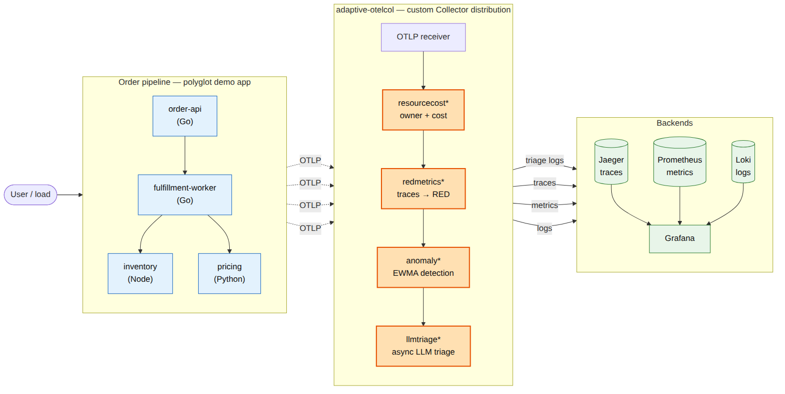
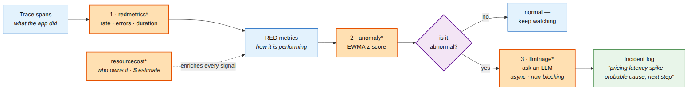
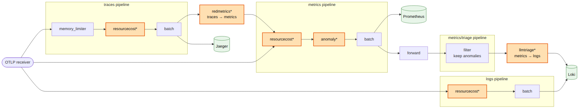
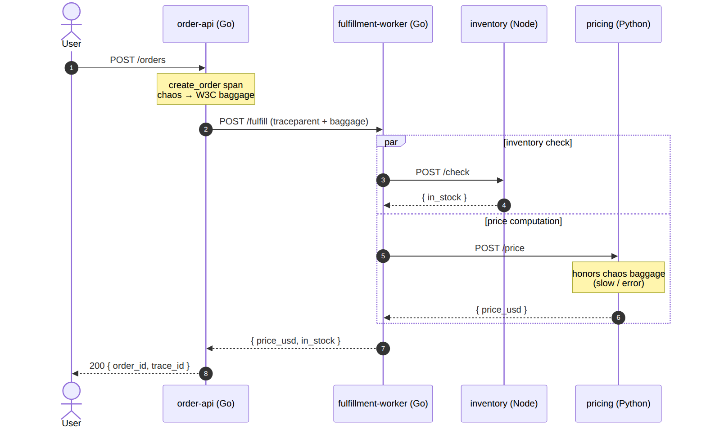
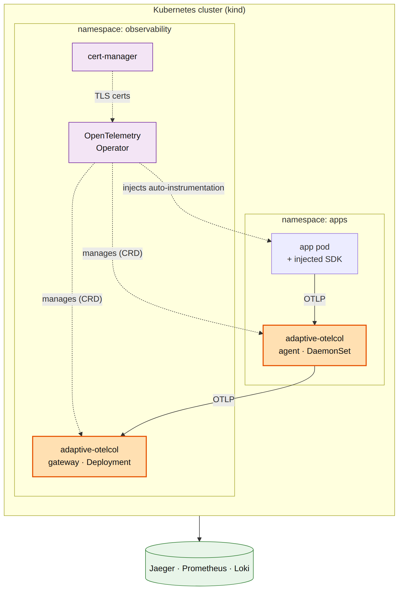

# Architecture

A technical deep-dive into how `adaptive-otelcol` turns a raw telemetry firehose into a governed, anomaly-aware, self-explaining stream. This traces the real pipeline in [`collector/config/collector.yaml`](../collector/config/collector.yaml); every claim below matches the code.

> Rendered diagrams live in [`docs/diagrams/rendered/`](diagrams/rendered) (sources in [`diagrams/src/`](diagrams/src), regenerated with `make diagrams`).

## The five pipelines

The collector wires **five pipelines** whose only cross-signal joins are connectors. Data flows left to right through the adaptive loop:

| Pipeline | Receivers | Processors | Exporters |
| --- | --- | --- | --- |
| `traces` | `otlp` | memory_limiter, **resourcecost**, batch | `otlp/jaeger`, **redmetrics** |
| `metrics` | `otlp`, **redmetrics** | memory_limiter, **resourcecost**, **anomaly**, batch | `prometheus`, **forward/anomalies** |
| `metrics/triage` | **forward/anomalies** | **filter/anomalies** | **llmtriage** |
| `logs` | `otlp` | memory_limiter, **resourcecost**, batch | `otlphttp/loki` |
| `logs/triage` | **llmtriage** | batch | `otlphttp/loki`, `debug` |

Tracing one request end to end:

1. The app exports OTLP traces to the `otlp` receiver. The **traces** pipeline enriches spans with owner/cost attributes, ships them to Jaeger, **and** feeds them to the `redmetrics` connector.
2. `redmetrics` aggregates spans into RED metrics and re-emits them **into the metrics pipeline** (it is a traces exporter on one side and a metrics receiver on the other).
3. The **metrics** pipeline enriches, then the `anomaly` processor scores each scalar point and tags `anomaly.score` / `anomaly.is_anomaly`. Scored metrics go to Prometheus **and** are fanned — via the stock `forward` connector — into the triage branch.
4. `filter/anomalies` keeps only points where `anomaly.is_anomaly == true`, then hands them to the `llmtriage` connector.
5. `llmtriage` asynchronously triages the anomalies and emits incident **log records** into the `logs/triage` pipeline, which batches them to Loki (and `debug`).

## Why connectors, not processors

Two of the four custom components are **connectors** because they cross signal boundaries, which a processor cannot do. `redmetrics` is a traces→metrics bridge; `llmtriage` is a metrics→logs bridge. Using two connectors with *different* signal pairs is deliberate — it exercises the connector model rather than smuggling signal conversion into a monolithic processor. The interesting behaviour is emergent from composition (a stock `filter` and `forward` do real work in the loop), which is idiomatic Collector design. See [ADR-0002](adr/0002-four-components-and-the-adaptive-loop.md).

## redmetrics — temporality and cardinality

`red.calls`, `red.errors`, and `red.duration.ms` are emitted **cumulative** (a fixed start timestamp, monotonically growing counts) because that is what Prometheus and the OTel metrics data model expect for counters and histograms. But the anomaly detector downstream needs the opposite: a single fresh scalar per interval. So `redmetrics` also emits `red.latency.avg.ms`, a **gauge** computed as a *delta* — `(sumMs − lastSumMs) / (calls − lastCalls)` since the previous flush. Cumulative for storage, delta for detection, from one aggregation pass.

Cardinality is bounded by `max_series`: distinct dimension combinations beyond the cap are dropped and counted (`dropped`), protecting the in-memory store from an un-normalized dimension (e.g. a raw URL) exploding series count. Aggregation state is guarded by a mutex because `ConsumeTraces` runs concurrently with the background flush ticker.

## anomaly — series identity, sharding, and the sweeper

A **series identity** is the string `resourceAttrs \x1f metricName \x1f dataPointAttrs`, where each attribute map is rendered order-independently (sorted `k=v` pairs). That identity keys a per-series EWMA detector.

Detectors live in a **sharded concurrent store**: `shards` lock-striped partitions (default 16), each a `map[string]*entry` under its own mutex, selected by FNV-1a hash of the key. Many concurrent `ConsumeMetrics` calls proceed in parallel as long as they touch different shards — the alternative, one global lock, would serialize the hot path.

Left alone, the map would grow O(series ever seen). A **stale-series sweeper** runs every `sweep_interval` and evicts any series unseen for longer than `stale_after`, making memory O(*active* series). An observable gauge, `anomaly.series.tracked`, exposes the live count so the flat-memory claim is verifiable, not asserted. See [ADR-0005](adr/0005-ewma-detector-and-its-limits.md).

## llmtriage — the async backpressure boundary

A Collector's `Consume*` methods are on the hot path; blocking one applies backpressure all the way back to the instrumented app. An LLM call is slow, rate-limited, and costs money — exactly the thing you must not do inline. `llmtriage` splits itself at a **bounded queue**:

- `ConsumeMetrics` only extracts flagged points and does a **non-blocking** enqueue (`select { case q <- a: default: drop++ }`), then returns. Under flood it *sheds load* rather than stalls ingestion.
- A worker pool drains the queue, batches related anomalies (`max_batch` / `max_wait`), debounces duplicate `(service, metric)` pairs, calls the LLM with a timeout, and emits the log on the component-lifetime context.

Throughput is thus independent of LLM latency (a test asserts `ConsumeMetrics` returns in <50 ms against a 300 ms backend). See [ADR-0004](adr/0004-async-llm-triage-boundary.md).

## The MutatesData ownership model

Every component declares `consumer.Capabilities{MutatesData: bool}`. If any component in a pipeline mutates data, the pipeline clones at fan-out; otherwise all consumers share one read-only copy. Declaring it wrong causes either data races (claiming read-only while mutating) or needless clones. Each component here declares the truth:

| Component | MutatesData | Why |
| --- | --- | --- |
| `resourcecost` | **true** | writes new resource attributes in place |
| `anomaly` | **true** | writes `anomaly.score` / `anomaly.is_anomaly` onto data points |
| `redmetrics` | **false** | reads spans, builds brand-new metrics |
| `llmtriage` | **false** | reads metrics, builds brand-new logs |

The two connectors construct fresh `pdata`, so they never mutate their input; the two processors enrich in place and pay for a clone at fan-out — an accepted cost, stated plainly. Where state is *also* shared across concurrent `Consume*` calls (`anomaly`'s store, `redmetrics`'s aggregation), it is guarded by a mutex or lock-striped shards and proven race-clean with `go test -race`. See [ADR-0003](adr/0003-data-ownership-and-mutatesdata.md).

## Deployment

The same distro runs locally on Docker Compose and on Kubernetes via the OpenTelemetry Operator (a gateway Deployment + a node-agent DaemonSet, with SDK auto-instrumentation injected by annotation). See [ADR-0006](adr/0006-operator-over-helm-kustomize.md) and [`deploy/k8s/README.md`](../deploy/k8s/README.md).

